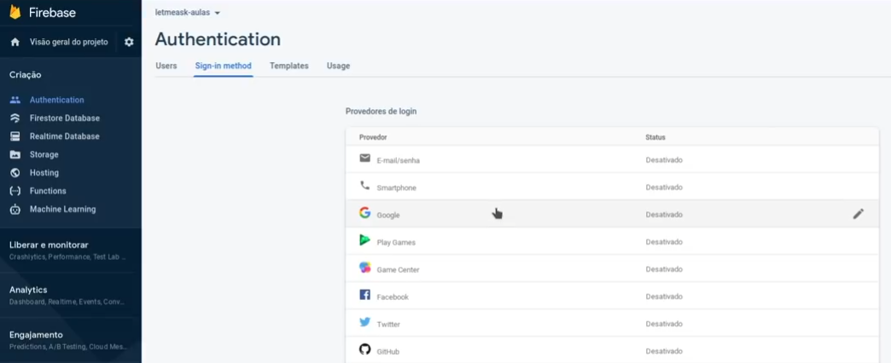
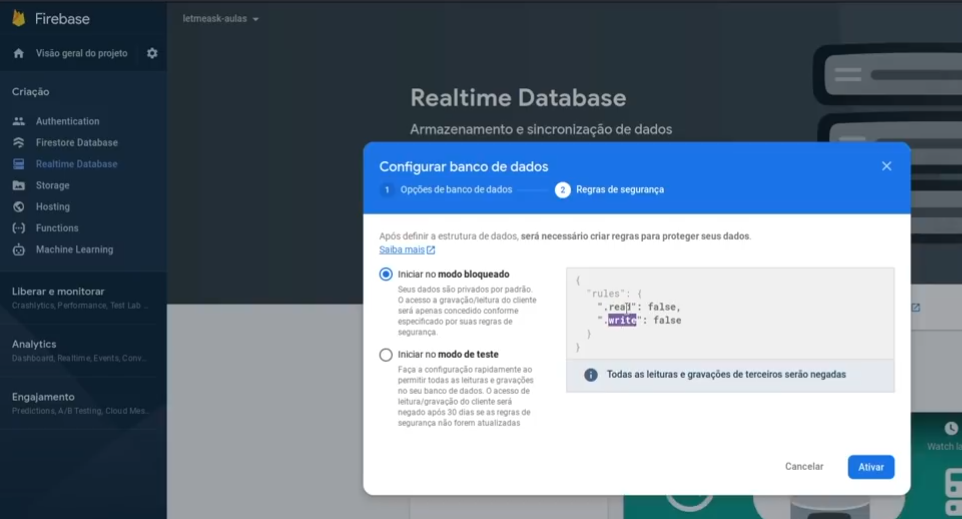
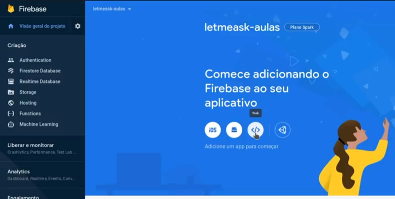
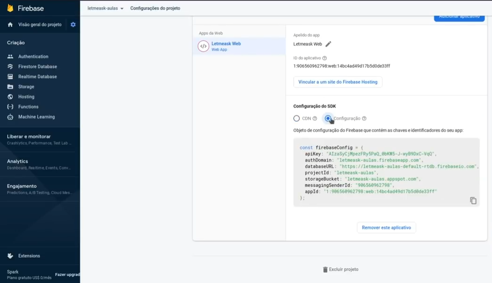
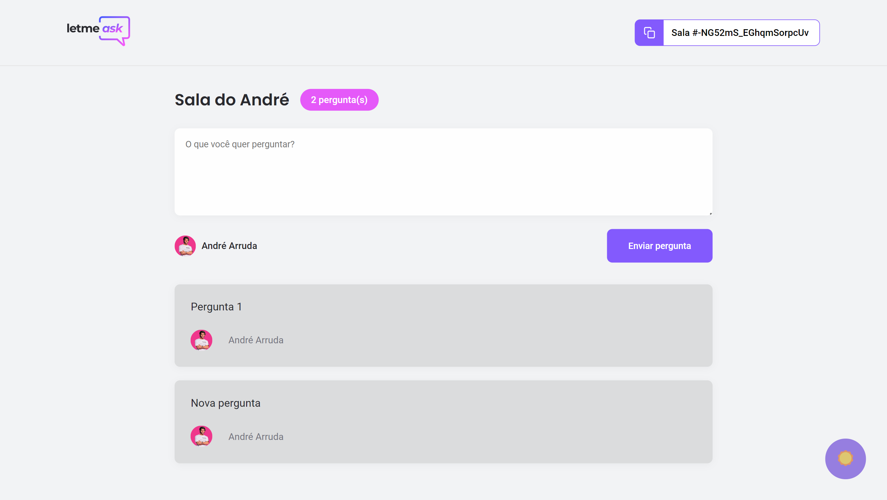
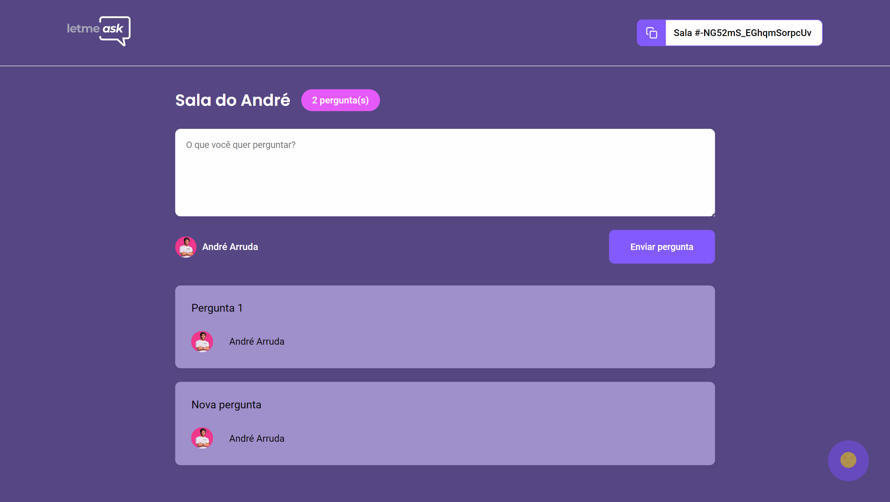
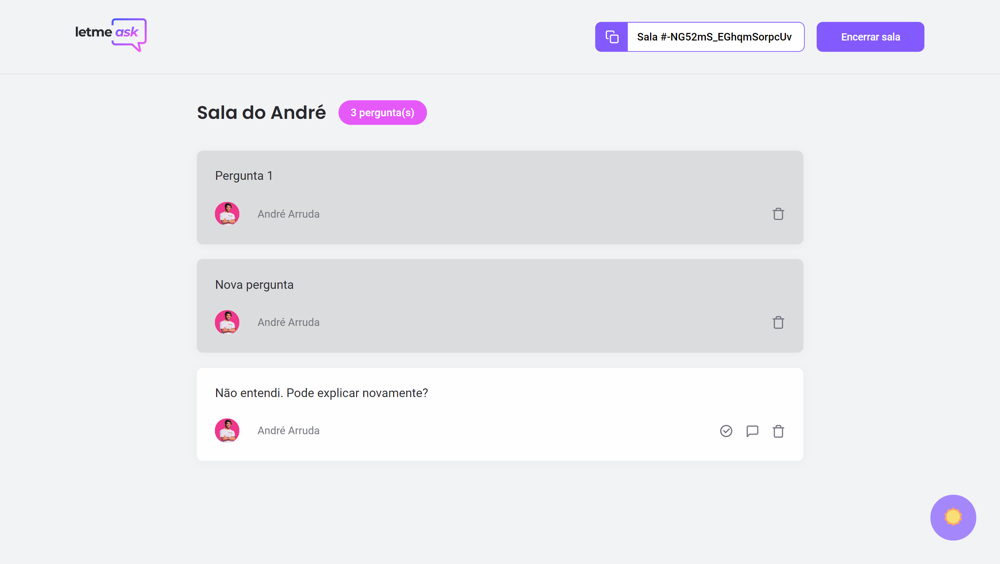
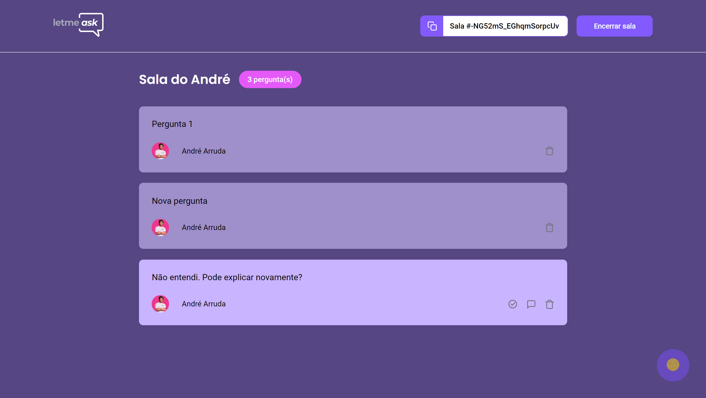

<h2 align="center">
    
</h2>

<h4 align="center">
  🚀 Next Level Week 6
</h4>

<p align="center">
  <a href="#-tecnologias">Tecnologias</a>&nbsp;&nbsp;&nbsp;|&nbsp;&nbsp;&nbsp;
  <a href="#-projeto">Projeto</a>&nbsp;&nbsp;&nbsp;|&nbsp;&nbsp;&nbsp;
  <a href="#instalação">Instalação</a>&nbsp;&nbsp;&nbsp;|&nbsp;&nbsp;&nbsp;
  <a href="#telas">Telas</a>
</p>

## 🚀 Tecnologias

Esse projeto foi desenvolvido com as seguintes tecnologias:

- [React](https://reactjs.org)
- [Firebase](https://firebase.google.com/)

## 💻 Projeto
**LetMeAsk é uma plataforma de interação entre usuários para envio e votação de perguntas.**

## Instalação
### Pré requisitos
- [Node](https://nodejs.org/en/download/)
- [Yarn](https://classic.yarnpkg.com/en/docs/install/)

### Criar projeto Firebase
[Firebase](https://console.firebase.google.com)
- Criar Projeto
- Habilitar serviço autenticação com Google
<div align="center">
    
</div>

- Criar Realtime Database no Projeto
<div align="center">
    
</div>

- Registrar App
<div align="center">
    
</div>

- Visão geral do projeto e pegar as chaves
<div align="center">
    
</div>

### Rodar no terminal
```sh
# clonar repositório
git clone https://github.com/andre23arruda/letmeask

# Instalar os pacotes do projeto
yarn install

# Renomear .env_example para .env
cp .env_example.local .env.local
# ADICIONE OS VALORES CORRETOS
```

## Telas
<div align="center">
    
    
</div>
<p align="center">Screen 1</p>
<hr>

<div align="center">
    
    
</div>
<p align="center">Screen 2</p>
<hr>

<div align="center">
    
    
</div>
<p align="center">Screen 3</p>
<hr>

<div align="center">
    
    
</div>
<p align="center">Screen 4</p>
<hr>
